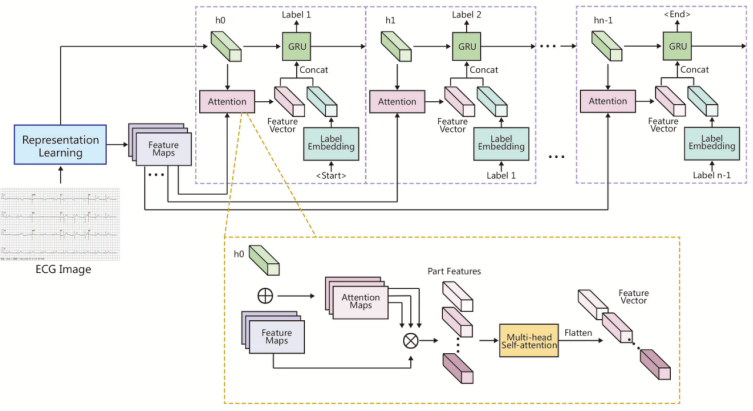

# Code for fine-grained-ecg
The official code for "Accurate diagnoses of 12-lead electrocardiograms using artificial intelligence: A fine-grained multi-label model for diagnostic assistance" by Zizhu Liu, Qing Cao, Qi Jin,Jingsheng Lin, Gang Lv and Kang Chen

This project test in `Tensorflow=1.15` and contains model only.

### Description

This model contains `cnn` and `rnn` parts, 


To call it, 
```
#chose config file first
config_path = 'resnet34_gru_spatial_hidden_concat_center_attn5part_multi_head_conv4_rgb192x480.json'

cfg_dict = update_and_save_cfg(CONFIG_DICT, config_path,
                                save_cfg=not st, date=not st)
cfg = dict2config(cfg_dict)
main(cfg)

# call the model
encoder, decoder = networks.build_model(cfg)

```

there are train and val example `in load_model.py`


