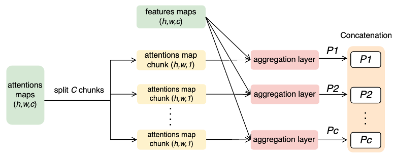
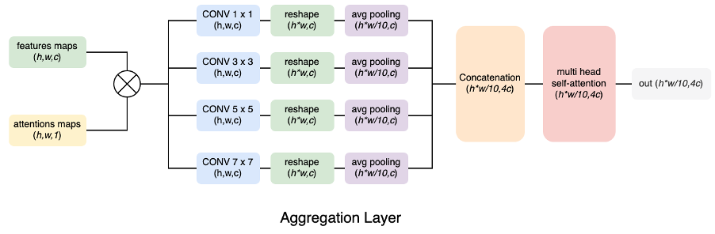

# Code for fine-grained-ecg
The official code for "Accurate diagnoses of 12-lead electrocardiograms using artificial intelligence: A attention aggregation multi-label model for diagnostic assistance" by Zizhu Liu, Qing Cao, Qi Jin,Jingsheng Lin, Gang Lv and Kang Chen
This project test in Tensorflow and contains model only.

### Description

##### model overall


##### attention maps


##### aggregation layer



Example:
```
from my_utils.default_config import dict2config, update_and_save_cfg, CONFIG_DICT
from models import networks

# chose config file first
config_path = 'AA_multi_label.json'
cfg_dict = update_and_save_cfg(CONFIG_DICT, config_path, save_cfg=False, date=False)
cfg = dict2config(cfg_dict)

# call the model
model = networks.build_model(cfg)
```


